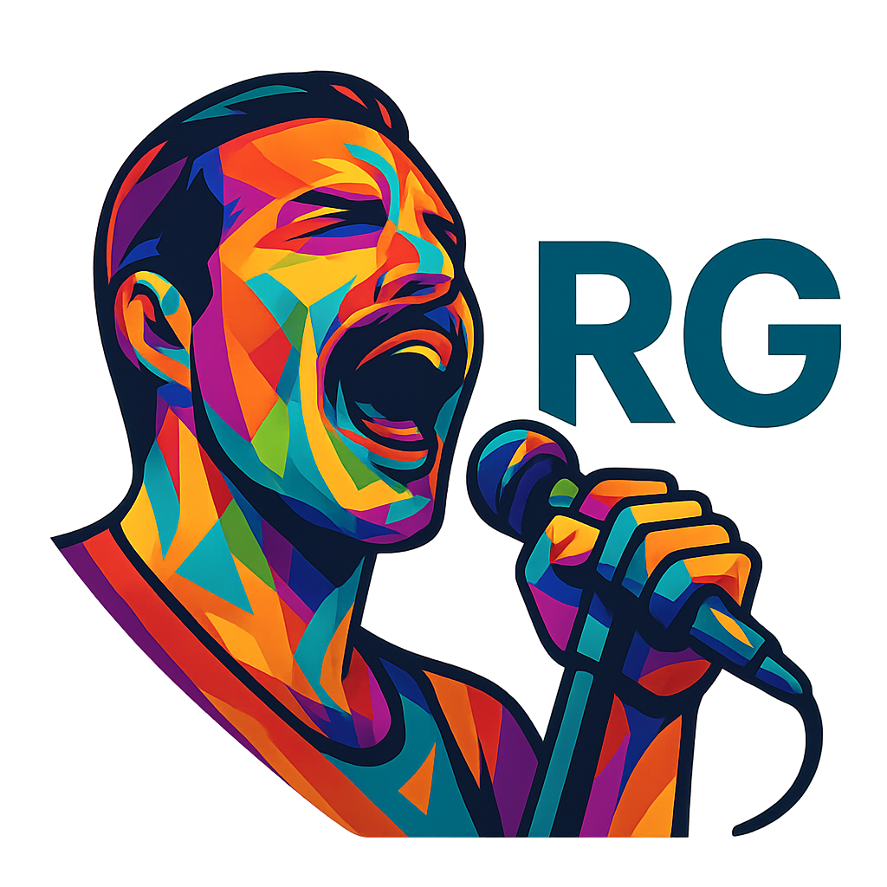

# 🎵 Radio RAGAG



A modern, AI-powered DJ application built with React and TypeScript that provides an immersive music experience with YouTube video integration, and fascinating music facts.

## ✨ Features

- **🎥 YouTube Video Integration**: Watch music videos while listening to your favorite songs
- **📋 Interactive Playlist**: Browse and select songs with real-time highlighting of the current track
- **🎛️ Advanced Player Controls**: Play, pause, skip, seek, and volume control
- **💡 Fun Facts**: Learn interesting trivia about each song and artist
- **🎨 Modern UI**: Beautiful, responsive design with glass morphism effects
- **Translated lyrics**: Watch synced lyrics in english and spanish.
- **📱 Responsive Design**: Works perfectly on desktop and mobile devices

## 🎵 Classic Rock Playlist

The app comes pre-loaded with 5 iconic classic rock songs:

1. **Bohemian Rhapsody** - Queen
2. **Stairway to Heaven** - Led Zeppelin
3. **Hotel California** - Eagles
4. **Sweet Child O' Mine** - Guns N' Roses
5. **Comfortably Numb** - Pink Floyd

## 🚀 Getting Started

### Prerequisites

- Node.js (version 16 or higher)
- npm or yarn

### Installation

1. Clone the repository:
```bash
git clone <repository-url>
cd radio_ragag
```

2. Install dependencies:
```bash
npm install
```

3. Start the development server:
```bash
npm run dev
```

4. Open your browser and navigate to `http://localhost:3000`

5. Start the Agentic Backend

```bash
python3 src/ragag_brain/app_radio_agent.py
```

## 🛠️ Tech Stack

- **Frontend**: React 18 with TypeScript
- **Styling**: Tailwind CSS with custom glass morphism effects
- **Video Player**: React YouTube component
- **Icons**: Lucide React
- **Build Tool**: Vite
- **Package Manager**: npm

## 📁 Project Structure

```
src/
├── components/            # React components
│   ├── VideoPlayer.tsx    # YouTube video player
│   ├── Playlist.tsx       # Song playlist display
│   ├── PlayerControls.tsx # Playback controls
│   ├── FunFacts.tsx       # Song trivia display
│   └── LyricsDisplay.tsx  # Song lyrics display
├── data/                  # Static data and generated files
│   ├── playlist.ts        # Song playlist data
│   └── voice_comments/    # AI-generated podcast audio
├── ragag_brain/           # Agentic AI backend
│   ├── app_radio_agent.py # Backend server API (Flask/FastAPI)
│   ├── podcast_agent.py   # LLM Podcast agent builder
│   ├── kokoro_voice.py    # Text-to-speech generation
│   ├── agent_tools.py     # Tools for the AI agent
│   └── prompts/           # LLM system prompts
├── types/                 # TypeScript type definitions
│   └── index.ts           # Interface definitions
├── App.tsx                # Main application component
├── main.tsx               # Application entry point
└── index.css              # Global styles
```

## 🎮 How to Use

1. **Select a Song**: Click on any song in the playlist to start playing
2. **Control Playback**: Use the player controls at the bottom to play, pause, skip, or adjust volume
3. **Watch Videos**: The YouTube video will automatically load for the selected song
4. **Learn Facts**: Read interesting trivia about the current song below the video
5. **Navigate**: Use the previous/next buttons or click directly on playlist items

## 🎨 Design Features

- **Glass Morphism**: Modern translucent UI elements with backdrop blur
- **Gradient Text**: Beautiful gradient effects on headings and highlights
- **Smooth Animations**: Hover effects and transitions throughout the interface
- **Dark Theme**: Easy on the eyes with a sophisticated dark color scheme
- **Responsive Grid**: Adapts to different screen sizes seamlessly

## 🔧 Customization

### Adding New Songs

To add new songs to the playlist, edit `src/data/playlist.ts`:

```typescript
{
  id: 'unique-id',
  title: 'Song Title',
  artist: 'Artist Name',
  duration: '3:45',
  youtubeId: 'YouTube-Video-ID',
  funFacts: 'Interesting facts about the song...',
  album: 'Album Name',
  year: 2023
}
```

### Styling

The app uses Tailwind CSS with custom utilities. You can modify:
- Colors in `tailwind.config.js`
- Global styles in `src/index.css`
- Component-specific styles in each component file

## 🚀 Deployment

To build for production:

```bash
npm run build
```

The built files will be in the `dist/` directory, ready for deployment to any static hosting service.

## 🤝 Contributing

1. Fork the repository
2. Create a feature branch
3. Make your changes
4. Test thoroughly
5. Submit a pull request

## 📄 License

This project is open source and available under the [MIT License](LICENSE).

## 🎵 Enjoy Your Music!

Sit back, relax, and enjoy your personal AI DJ experience with classic rock hits and fascinating music trivia! 